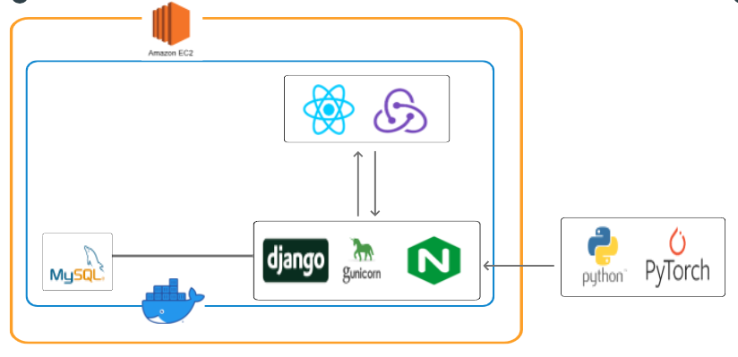

# Re:tter
> 💌 소중한 사람들에게 마음을 전해요.
TTS 모델을 활용한 음성카드 만들기 서비스

1. 일정 : 2021.02.12 - 2021.04.08 (총 7주)

2. 인원 (총 6인)

   - 김은서 : 팀장, Backend, AI, Infra
   - 김혜인 : Frontend
   - 노건우 : Backend, AI
   - 서예진 : Backend, AI
   - 성당현 : Frontend
   - 윤지영 : Backend, AI, Infra

3. 기술 스택

   - Frontend : React
   - Backend : django, Python
   - AI : Pytorch
   - Infra : Docker
   - DB : MySQL

4. 아키텍처

​	
